# 🍕 Pizza Sales Analysis Using SQL

## Introduction

This project explores pizza sales data using SQL to uncover valuable business insights related to revenue generation, customer ordering behavior, product performance, and sales trends.

By analyzing transactional data from a pizza restaurant, the project demonstrates how SQL can be used to answer real-world business questions and support data-driven decision-making.

SQL queries? Check them out here: [project_pizaa_sql folder](/project_pizaa_sql/) 

---

# Background

The objective of this project was to strengthen SQL skills through hands-on analysis of a real-world sales dataset.

The dataset contains information about customer orders, pizza categories, pizza sizes, pricing, and order quantities. Through a series of SQL queries, I explored sales performance, customer preferences, and revenue trends.

### Questions Answered

* What is the total number of orders placed?
What is the total revenue generated from pizza sales?
* Which pizza has the highest price?
* What is the most commonly ordered pizza size?
* Which are the top 5 most ordered pizza types, and how many times was each ordered?
* What is the total quantity ordered for each pizza category?
* How are orders distributed across different hours of the day?
* What is the category-wise distribution of pizzas sold?
* What is the average number of pizzas ordered per day?
* Which are the top 3 pizza types that generate the highest revenue?
* What percentage of total revenue does each pizza type contribute?
* How does cumulative revenue grow over time?
* Which are the top 3 revenue-generating pizza types within each pizza category?

---

# Dataset Overview

The project uses four relational tables:

### Orders

| Column   | Description             |
| -------- | ----------------------- |
| order_id | Unique order identifier |
| date     | Order date              |
| time     | Order time              |

### Order Details

| Column           | Description                    |
| ---------------- | ------------------------------ |
| order_details_id | Unique order detail identifier |
| order_id         | References Orders table        |
| pizza_id         | References Pizzas table        |
| quantity         | Quantity ordered               |

### Pizzas

| Column        | Description                  |
| ------------- | ---------------------------- |
| pizza_id      | Unique pizza identifier      |
| pizza_type_id | References Pizza Types table |
| size          | Pizza size                   |
| price         | Pizza price                  |

### Pizza Types

| Column        | Description                  |
| ------------- | ---------------------------- |
| pizza_type_id | Unique pizza type identifier |
| name          | Pizza name                   |
| category      | Pizza category               |
| ingredients   | Pizza ingredients            |

---

# Tools Used

### PostgreSQL

Used to store and query the pizza sales database.

### SQL

Used for data extraction, aggregation, ranking, and revenue analysis.

### pgAdmin 4

Used for database management and query execution.

### Git & GitHub

Used for version control and project showcasing.

---

# The Analysis

Each query focuses on answering a specific business question.

---

## 1. Total Number of Orders

This query calculates the total number of orders placed by customers.

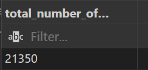

### Business Insight

* Measures overall restaurant activity.
* Serves as a baseline KPI for sales performance.
* Helps evaluate customer demand.

---

## 2. Total Revenue Generated

This query calculates total revenue generated from pizza sales.

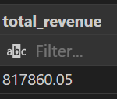

### Business Insight

* Determines overall business performance.
* Helps track profitability.
* Provides a key metric for growth analysis.

---

## 3. Highest-Priced Pizza

This query identifies the most expensive pizza on the menu.

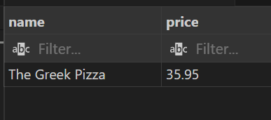

### Business Insight

* Highlights premium products.
* Helps understand pricing strategy.
* Useful for menu optimization.

---

## 4. Most Common Pizza Size Ordered

This query identifies the pizza size customers order most frequently.

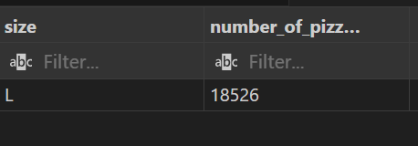

### Business Insight

* Reveals customer preferences.
* Supports inventory planning.
* Helps optimize packaging requirements.

---

## 5. Top 5 Most Ordered Pizza Types

This query ranks pizzas by total quantity sold.

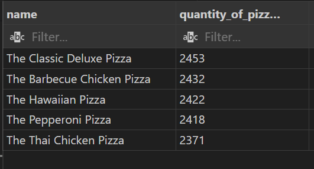

### Business Insight

* Identifies customer favorites.
* Helps focus marketing efforts.
* Supports menu planning decisions.

---

## 6. Total Quantity Ordered by Pizza Category

This query calculates total pizzas sold within each category.

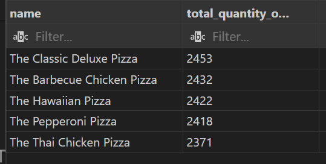

### Business Insight

* Reveals category popularity.
* Helps determine best-performing product groups.
* Supports menu expansion decisions.

---

## 7. Distribution of Orders by Hour

This query analyzes ordering activity throughout the day.

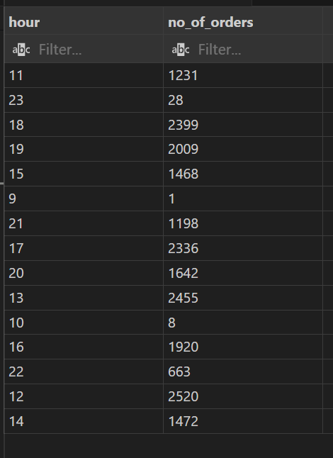

### Business Insight

* Identifies peak business hours.
* Helps optimize staffing.
* Supports operational planning.

---

## 8. Category-Wise Pizza Distribution

This query examines how pizza sales are distributed across categories.

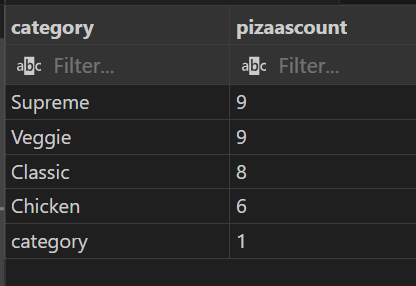

### Business Insight

* Highlights customer preferences.
* Identifies underperforming categories.
* Assists in product strategy.

---

## 9. Average Number of Pizzas Ordered Per Day

This query calculates daily average pizza sales.

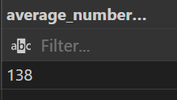

### Business Insight

* Measures daily demand.
* Useful for forecasting.
* Supports inventory management.

---

## 10. Top 3 Pizza Types by Revenue

This query identifies pizzas generating the highest revenue.

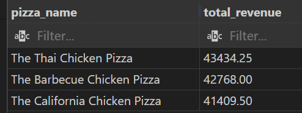

### Business Insight

* Highlights top revenue drivers.
* Helps prioritize high-value products.
* Supports pricing decisions.

---

## 11. Revenue Contribution Percentage by Pizza Type

This query calculates each pizza's contribution to total revenue.

### Business Insight

* Reveals products driving overall sales.
* Helps identify high-impact menu items.
* Supports strategic decision-making.

---

## 12. Cumulative Revenue Analysis

This query tracks revenue growth over time using window functions.

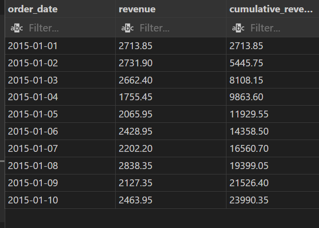

### Business Insight

* Shows revenue accumulation trends.
* Helps monitor business growth.
* Useful for performance tracking.

---

## 13. Top 3 Revenue-Generating Pizzas Within Each Category

This query ranks pizzas by revenue inside their respective categories.

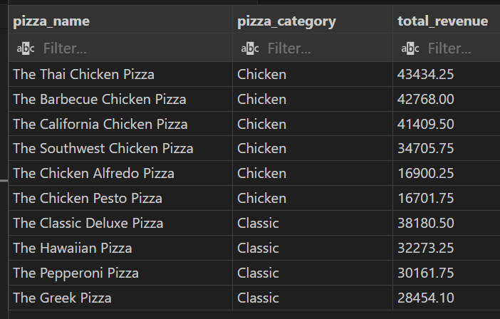

### Business Insight

* Identifies category leaders.
* Enables category-level comparisons.
* Supports targeted promotions.

---

# What I Learned

Through this project, I strengthened my understanding of:

* SQL query writing
* Relational database concepts
* Data aggregation techniques
* Window functions
* Revenue analysis
* Business-focused data analysis
* Converting business questions into SQL solutions

---

# Conclusion

This project demonstrates how SQL can be used to transform raw transactional data into actionable business insights.

The analysis provided a deeper understanding of customer purchasing behavior, sales performance, revenue trends, and product popularity. These insights can help businesses make informed decisions regarding inventory management, pricing strategies, staffing, and product offerings.

---

